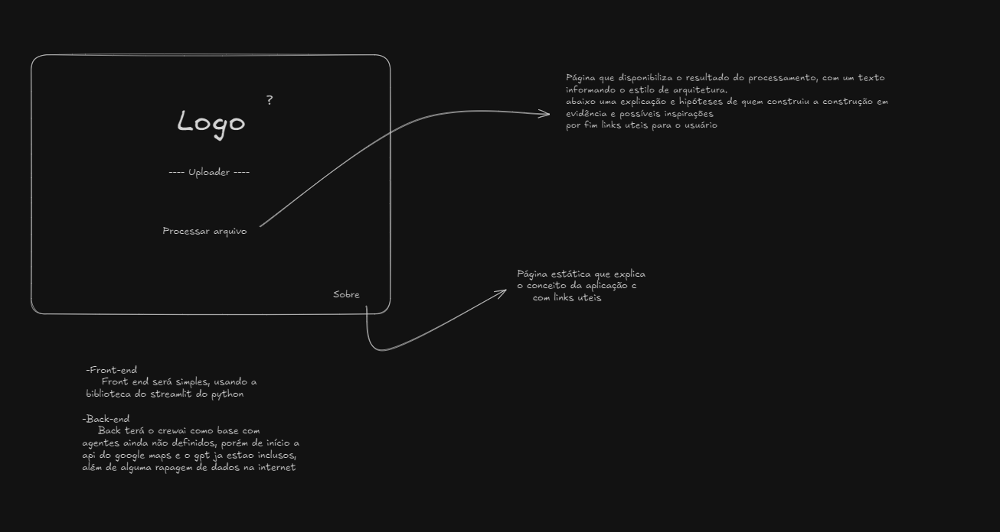
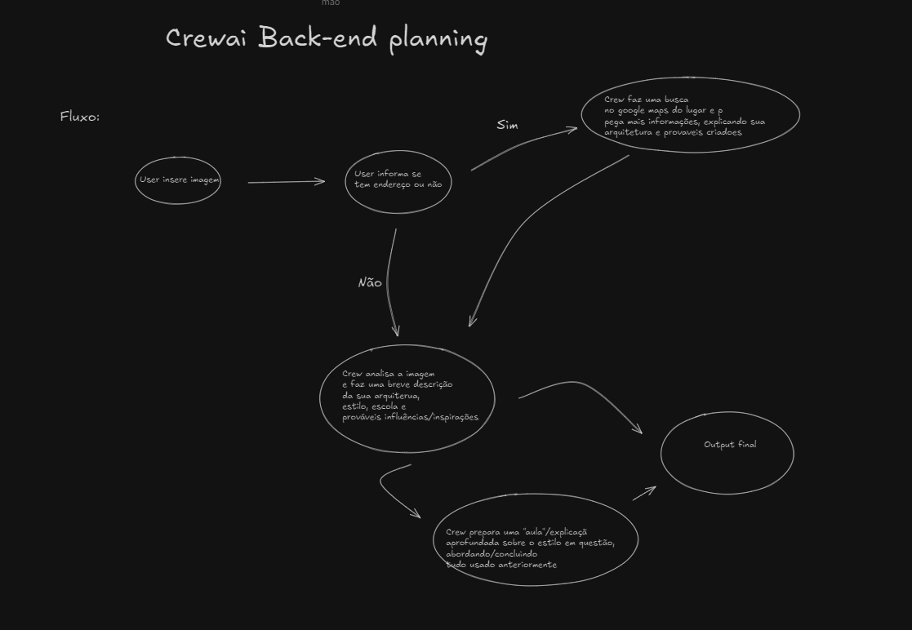
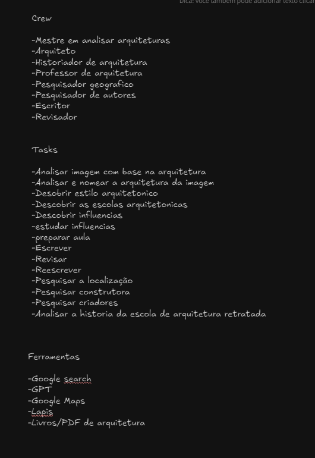

# Conversa sobre Software para Análise de Inspirações Arquitetônicas

## Contexto Inicial
Vitor está criando um software baseado na ferramenta de multiagentes "Crear.ai" que irá identificar, em um modelo arquitetônico, suas inspirações. Por exemplo, ele pode compartilhar o projeto ou fotos da Cidade Administrativa de Minas Gerais, e o modelo retornará um estudo baseado nas referências, inspirações e autores usados na construção.

---

## Grade Curricular de Bacharel em Arquitetura da UFMG
O curso de Arquitetura e Urbanismo da Universidade Federal de Minas Gerais (UFMG) é oferecido em dez semestres, totalizando aproximadamente 3.600 horas. A grade curricular abrange diversas áreas, incluindo:

- **Representação Gráfica e Expressão Arquitetônica**
- **Teoria, História e Patrimônio Cultural**
- **Engenharia Estrutural e Tecnologia da Arquitetura e do Urbanismo**
- **Planejamento Arquitetônico, Urbano e Regional**

O objetivo do curso é formar arquitetos e urbanistas capazes de atender às demandas da sociedade, desenvolvendo projetos que promovam qualidade de vida, equilíbrio ecológico e bem-estar geral. As atividades profissionais abrangem o desenvolvimento de projetos, construção e manutenção de edificações, conjuntos arquitetônicos e monumentos, arquitetura paisagística e de interiores, além de planejamento físico em diversas escalas.  

Para informações detalhadas sobre a grade curricular do curso diurno, recomenda-se consultar o site oficial da Escola de Arquitetura da UFMG.

---

## Escolas/Estilos Arquitetônicos e seus Entusiastas
### Principais Escolas e Estilos da Arquitetura

1. **Arquitetura Clássica (Grécia e Roma Antiga)**
   - Características: Colunas, simetria, proporções matemáticas, ordem dórica, jônica e coríntia.
   - Entusiastas/Criadores: Vitruvius (autor de *De Architectura*).

2. **Arquitetura Românica (Séculos X-XII)**
   - Características: Arcos semicirculares, paredes grossas, pequenas janelas, influência religiosa.
   - Entusiastas/Criadores: Difundido pelos monges beneditinos.

3. **Arquitetura Gótica (Séculos XII-XVI)**
   - Características: Arcos ogivais, vitrais coloridos, contrafortes, torres pontiagudas.
   - Entusiastas/Criadores: Abade Suger (início do estilo gótico na Abadia de Saint-Denis).

4. **Arquitetura Renascentista (Séculos XV-XVI)**
   - Características: Proporções clássicas, cúpulas, simetria, ornamentos inspirados na Antiguidade.
   - Entusiastas/Criadores: Filippo Brunelleschi (Cúpula da Catedral de Florença), Leon Battista Alberti.

5. **Barroco (Séculos XVII-XVIII)**
   - Características: Exuberância, ornamentação dramática, movimento, teatralidade.
   - Entusiastas/Criadores: Gian Lorenzo Bernini, Francesco Borromini.

6. **Rococó (Século XVIII)**
   - Características: Elegância, decoração delicada, uso de cores pastel.
   - Entusiastas/Criadores: François de Cuvilliés (Palácio de Amalienburg).

7. **Neoclassicismo (Século XVIII-XIX)**
   - Características: Retorno à simplicidade e austeridade clássicas.
   - Entusiastas/Criadores: Andrea Palladio, Jacques-Germain Soufflot.

8. **Arquitetura Moderna (Séculos XIX-XX)**
   - Características: Funcionalidade, materiais industriais, rejeição de ornamentação excessiva.
   - Entusiastas/Criadores: Le Corbusier, Ludwig Mies van der Rohe, Frank Lloyd Wright.

9. **Arquitetura Pós-Moderna (Anos 1970-2000)**
   - Características: Estética eclética, reinterpretação do passado, uso de cores e formas ousadas.
   - Entusiastas/Criadores: Robert Venturi, Michael Graves.

10. **Arquitetura Contemporânea (Século XXI)**
    - Características: Sustentabilidade, inovação tecnológica, formas dinâmicas e não-lineares.
    - Entusiastas/Criadores: Zaha Hadid, Frank Gehry, Norman Foster.

11. **Arquitetura Vernacular**
    - Características: Uso de materiais locais, adaptação às condições climáticas e culturais.
    - Entusiastas/Criadores: Desenvolvido coletivamente, sem autores específicos.

12. **Arquitetura Paramétrica**
    - Características: Uso de software para criar formas orgânicas e complexas.
    - Entusiastas/Criadores: Patrik Schumacher.

---

---

## Outros estilos 
### Estilos dentro das Escolas e Períodos da Arquitetura

1. **Brutalismo**
   - O Brutalismo é um estilo arquitetônico que faz parte do movimento Arquitetura Moderna, mas possui características distintas que o diferenciam de outras abordagens dentro desse movimento. Surgiu após a Segunda Guerra Mundial, nos anos 1950 e 1960, como uma evolução do modernismo, com forte influência do trabalho de arquitetos como Le Corbusier.
   - Características do Brutalismo:
   Uso predominante de concreto aparente (daí o termo "brutal", derivado de "béton brut", que significa "concreto bruto" em francês).
   Estruturas robustas e monumentais, com ênfase na funcionalidade.
   Aparência austera e direta, com formas geométricas simples e elementos muitas vezes expostos (como sistemas estruturais e materiais).
   - Foco em criar edifícios que fossem acessíveis e práticos, muitas vezes para habitação pública, instituições educacionais e espaços culturais.
   - Principais Entusiastas e Criadores:
   Le Corbusier: Inspirou o brutalismo com projetos como o Unité d'Habitation em Marselha.
   Alison e Peter Smithson: Arquitetos britânicos que popularizaram o termo e o estilo na Europa.
   Marcel Breuer: Projetou edifícios brutalistas icônicos como o Whitney Museum (atual Met Breuer) em Nova York.
   Paul Rudolph: Conhecido por projetos como o Yale Art and Architecture Building.
   O brutalismo se tornou polêmico devido à sua aparência muitas vezes considerada "dura" ou "fria", mas é celebrado por sua honestidade material e impacto visual. Hoje, muitos edifícios brutalistas são marcos arquitetônicos reconhecidos globalmente.

2. **Arquitetura Bizantina**
   - Período: Séculos IV-XV
   - Características:
   Cúpulas sobre pendentes.
   Decoração luxuosa com mosaicos dourados e iconografia religiosa.
   Uso de arcos semicirculares e colunas finas. Exemplo Notável: Basílica de Santa Sofia, Istambul.
   Entusiastas: Arquitetos anônimos do Império Bizantino.

3. **Arquitetura Islâmica**
   - Período: Século VII em diante
   - Características:
   Uso de padrões geométricos e arabescos.
   Elementos como minaretes, arcos em ferradura, e cúpulas.
   Decoração rica com cerâmicas e caligrafia árabe. Exemplo Notável: Alhambra, na Espanha.
   Entusiastas: Arquitetos das dinastias Omíada e Abássida.

4. **Arquitetura Art Nouveau**
   - Período: Fim do século XIX e início do século XX
   - Características:
   Linhas curvas e fluidas inspiradas na natureza.
   Uso de novos materiais como ferro forjado e vidro.
   Decoração rica e orgânica. Exemplo Notável: Casa Batlló, de Antoni Gaudí, em Barcelona.
   Entusiastas: Antoni Gaudí, Victor Horta, Hector Guimard.

5. **Arquitetura Bauhaus**
   - Período: Anos 1920-1930
   - Características:
   Simplicidade e funcionalidade.
   Linhas retas e design minimalista.
   Integração entre arte, tecnologia e arquitetura. Exemplo Notável: Edifício Bauhaus, em Dessau.
   Entusiastas: Walter Gropius, Ludwig Mies van der Rohe.

6. **Arquitetura High-Tech**
   - Período: Anos 1970-1980
   - Características:
   Uso de materiais industriais como aço e vidro.
   Exposição de elementos estruturais e tecnológicos.
   Estilo moderno com foco em funcionalidade. Exemplo Notável: Centre Pompidou, de Renzo Piano e Richard Rogers.
   Entusiastas: Norman Foster, Richard Rogers, Renzo Piano.

7. **Arquitetura Neogótica**
   - Período: Século XIX
   - Características:
   Reinterpretação dos elementos góticos (arcos ogivais, vitrais).
   Uso em igrejas, universidades e prédios públicos. Exemplo Notável: Parlamento Britânico, de Charles Barry e Augustus Pugin.
   Entusiastas: Augustus Pugin, John Ruskin.

8. **Arquitetura Deconstructivista**
   - Período: Anos 1980 em diante
   - Características:
   Fragmentação e formas não lineares.
   Aparência caótica e ausência de simetria. Exemplo Notável: Museu Guggenheim, de Frank Gehry, em Bilbao.
   Entusiastas: Frank Gehry, Zaha Hadid, Daniel Libeskind.

9. **Arquitetura Metabólica**
   - Período: Década de 1960 (Japão)
   - Características:
   Estruturas modulares e flexíveis.
   Uso de formas futuristas. Exemplo Notável: Nakagin Capsule Tower, de Kisho Kurokawa.
   Entusiastas: Kenzo Tange, Kisho Kurokawa.

10. **Arquitetura Futurista**
      - Período: Início do século XX
      - Características:
      Formas dinâmicas e inspiradas em velocidade e tecnologia.
      Uso de materiais modernos como aço e concreto. Exemplo Notável: Estação Ferroviária de Bolonha (projetos).
      Entusiastas: Antonio Sant’Elia, Filippo Marinetti.

11. **Arquitetura Vernacular Contemporânea**
      - Período: Século XXI
      - Características:
      Combinação de técnicas tradicionais com tecnologias modernas.
      Sustentabilidade e uso de materiais locais. Exemplo Notável: Songdo International Business District, Coreia do Sul.
      Entusiastas: Equipes colaborativas e coletivos regionais.
---

## Como um Projeto Arquitetônico é Compartilhado?
### Principais Formas de Compartilhamento:

1. **Documentação Impressa**
   - Plantas baixas, cortes e elevações, detalhamentos construtivos.
   - Compartilhados em papel de grande formato (A1 ou A0).

2. **Arquivos Digitais (CAD e BIM)**
   - CAD: Arquivos em DWG ou DXF.
   - BIM: Arquivos em RVT ou IFC.
   - Compartilhados via e-mail ou plataformas de nuvem.

3. **Apresentações e Relatórios**
   - Renderizações, diagramas conceituais, análises de viabilidade.
   - Compartilhados em PDF ou apresentações (PowerPoint, Keynote).

4. **Maquetes**
   - Físicas: Papel, madeira ou plástico.
   - Digitais: Modelos 3D em SketchUp, Blender ou Rhino.

5. **Realidade Aumentada e Virtual**
   - Ferramentas: Oculus Rift, HTC Vive, BIMx.
   - Uso interativo em apresentações.

6. **Plataformas de Colaboração Online**
   - Ferramentas: Autodesk BIM 360, Procore.

7. **Memoriais Descritivos e Técnicos**
   - Descrição do conceito, especificações técnicas, normas aplicáveis.
   - Compartilhados em PDF ou impressos.

8. **Comunicação Direta**
   - Reuniões presenciais ou online via Zoom, Microsoft Teams.

---

## Compartilhamento para LLMs
### Formatos Recomendados:
1. **PDF (Projetos Completos)**
   - Consolidar imagens, textos e esquemas em um único arquivo.
   - Suporta metadados que podem ser extraídos automaticamente pela LLM.

2. **PNG/JPEG (Imagens Individuais)**
   - Recomendado para fotos, renderizações e detalhes visuais.

3. **CAD ou BIM (Avançado)**
   - Arquivos DWG, DXF ou IFC para análises detalhadas.

4. **Texto Estruturado ou JSON**
   - Fornecer dados descritivos, história do projeto, objetivos e inspirações iniciais.

### Recomendação Final:
- **PDF combinado com imagens PNG** para simplicidade e compatibilidade.
- Incluir modelos CAD/BIM e descrições estruturadas para análises técnicas aprofundadas.

## imagem da ideia inicial
 
 
 